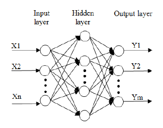

# A simple artificial neural network

It is a simple ANN based on c++. Coding it just for deepening my understanding for neural network. By this project, I better understand neuron, layer, network, back propagation, gradient descent and so on.

This picture may be helpful

the project contains four classes:

* AnnNeuron
* AnnLayer
* AnnNet
* AnnData

## Test

I use the digits recogniton as a example.
